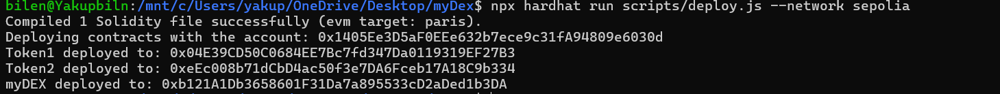

# myDEX

myDEX is a decentralized exchange (DEX) smart contract built on the Ethereum blockchain. It allows users to add liquidity, remove liquidity, and swap between two ERC20 tokens with a small transaction fee.

## Features

- **Add Liquidity**: Users can add liquidity to the pool by depositing two types of ERC20 tokens.
- **Remove Liquidity**: The owner can remove liquidity from the pool.
- **Swap Tokens**: Users can swap between the two ERC20 tokens with a 1% transaction fee.
- **Adjustable Fee**: The owner can adjust the transaction fee.

## Prerequisites

- Node.js
- Hardhat
- Ethereum wallet (e.g., MetaMask)
- Two ERC20 tokens deployed on the Ethereum network

## Installation

1. Clone the repository:
    ```bash
    git clone https://github.com/etherbiln/myDex-Solidity.git
    cd myDex-Solidity
    ```

2. Install dependencies:
    ```bash
    npm install
    ```

3. Configure the Hardhat environment by creating a `.env` file and adding your private key and Infura project ID:
    ```bash
    INFURA_PROJECT_ID=your_infura_project_id
    PRIVATE_KEY=your_private_key
    ```

## Deployment

1. Compile the smart contracts:
    ```bash
    npx hardhat compile
    ```

2. Deploy the smart contracts:
    ```bash
    npx hardhat run scripts/deploy.js --network rinkeby
    ```

## Usage

### Adding Liquidity

To add liquidity, call the `addLiquidity` function with the amounts of each token you want to deposit.

### Removing Liquidity

Only the owner can remove liquidity by calling the `removeLiquidity` function with the amounts of each token to withdraw.

### Swapping Tokens

To swap tokens, call either the `swapToken1ForToken2` or `swapToken2ForToken1` function with the amount of tokens you want to swap.

### Adjusting the Fee

The owner can adjust the transaction fee by calling the `setFeePercent` function with the new fee percentage.

### Test Deploy



