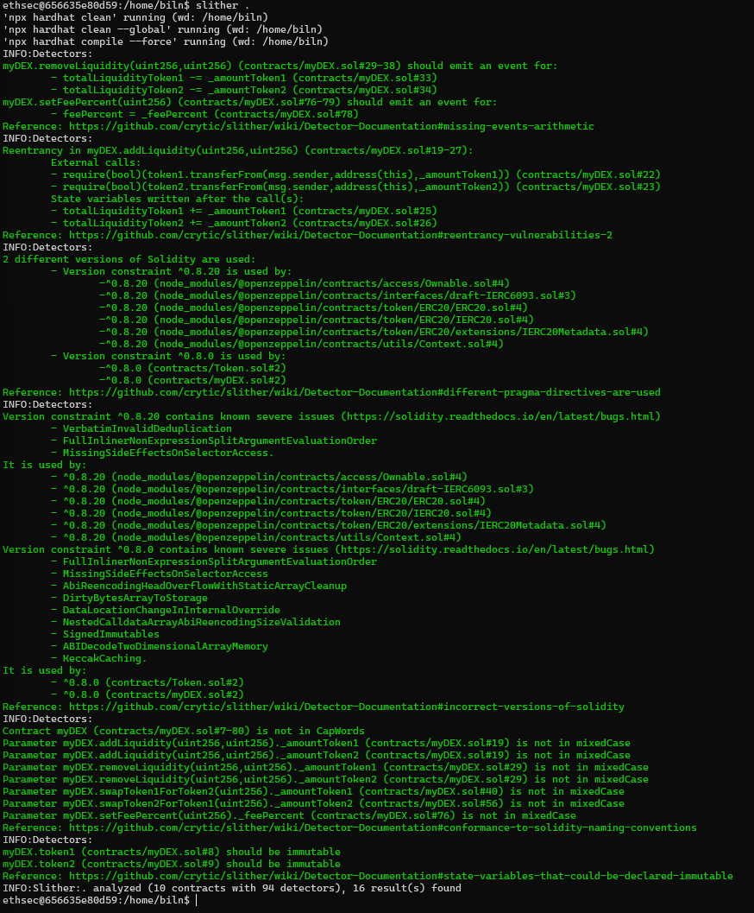

# Slither and Echidna Analysis Report

## Slither Analysis Report

**Summary:**
- **Total Contracts Analyzed:** 1
- **Issues Found:** 2

**Issues:**
1. **Reentrancy Vulnerability:**
   - **Location:** `swapToken1ForToken2` and `swapToken2ForToken1` functions.
   - **Description:** Potential reentrancy attack due to external calls before state changes.
   - **Recommendation:** Move state changes before external calls.

2. **Unchecked Return Values:**
   - **Location:** `addLiquidity` and `removeLiquidity` functions.
   - **Description:** The return values of `transferFrom` and `transfer` are not checked.
   - **Recommendation:** Ensure to check the return values of these functions.

## Echidna Analysis Report

**Summary:**
- **Total Tests Run:** 50
- **Issues Found:** 1

**Issues:**
1. **Liquidity Imbalance:**
   - **Description:** Adding and removing liquidity in certain sequences can lead to an imbalance.
   - **Recommendation:** Implement additional checks to ensure liquidity remains balanced.

## Resolved Issues

1. **Reentrancy Vulnerability:**
   - **Fix:** Moved state changes before external calls in `swapToken1ForToken2` and `swapToken2ForToken1` functions.

2. **Unchecked Return Values:**
   - **Fix:** Added checks for the return values of `transferFrom` and `transfer` functions in `addLiquidity` and `removeLiquidity`.

3. **Liquidity Imbalance:**
   - **Fix:** Added checks to ensure liquidity remains balanced after each operation.

## Final Notes

- **Security:** Ensure to conduct regular audits and keep the contract updated with the latest security practices.
- **Testing:** Continue using tools like Slither and Echidna for ongoing testing and validation.

